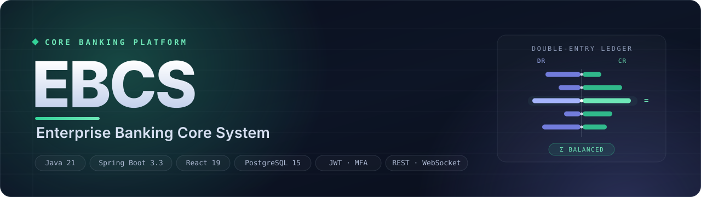

<!-- ========================================================= -->
<!--  EBCS · Enterprise Banking Core System · README           -->
<!-- ========================================================= -->

<p align="center">
  
</p>

# Enterprise Banking Core System (EBCS)

<p align="center">
  <b>A production-inspired, enterprise-scale core banking platform built with Spring Boot, React, PostgreSQL, and modern software architecture principles.</b><br/>
  Customers · Accounts · Transactions · Deposits · Loans · Double-entry Ledger — behind a real-time React console.
</p>

Enterprise Banking Core System (EBCS) is a full-stack reference implementation of a modern banking platform designed to demonstrate enterprise-grade software engineering practices. The project integrates secure banking operations, modular architecture, real-time communication, and production-oriented development workflows into a single banking ecosystem.

<p align="center">

<a href="https://ebcs-banking-system.vercel.app/login">

</a>

<a href="./docs">
    
</a>

<a href="https://ebcs-backend.onrender.com/swagger-ui.html">
    
</a>


| **Frontend Deployment** | Vercel |
| **Backend Deployment** | Render |
| **Database** | Neon PostgreSQL |
| **Containerization** | Docker Compose |

## 🌐 Live Deployment

| Service | Status | URL |
|----------|:------:|-----|
| 🌍 Frontend | ✅ Live | https://ebcs-banking-system.vercel.app/login |
| ⚙️ Backend API | ✅ Live | https://ebcs-backend.onrender.com |
| 📡 Swagger UI | ✅ Live | https://ebcs-backend.onrender.com/swagger-ui.html |

> **The complete application is publicly deployed and can be evaluated without any local installation or configuration.**

## ⚡ Quick Evaluation

Reviewers can evaluate the project in three different ways:

- 🌐 Explore the live application through the deployed frontend.
- 📡 Inspect and test REST APIs using the interactive Swagger UI.
- 💻 Run the complete system locally using Docker Compose.

## 🚀 Demo Credentials

To help recruiters and reviewers explore the application without creating their own account, a demo environment is available.

| Role | User Name | Password |
|------|-----------|----------|
| Administrator / Bank Manager | admin | Admin@123 |
| Banking Officer / Bank Staff | anand | Anand@123 |

> These credentials provide access to a sandbox environment for evaluation purposes only. Demo data may be reset periodically.

## 💻 Local Development

Prefer running locally?

The project can be started with a single Docker Compose command.

```bash
docker compose up --build
```

</p>

<p align="center">
  
  
  
  
  
  
  
</p>


| Category | Details |
|----------|----------|
| **Project Type** | Enterprise Banking Platform |
| **Architecture** | Modular Monolith |
| **Language** | Java 21 |
| **Backend Framework** | Spring Boot 3.3.5 |
| **Frontend Framework** | React 19 |
| **Database** | PostgreSQL with Flyway Migrations |
| **Authentication** | Spring Security + JWT + MFA |
| **Communication** | REST APIs + WebSocket (STOMP) |
| **Deployment** | Vercel • Render • Neon |
| **Containerization** | Docker & Docker Compose |
| **API Documentation** | OpenAPI (Swagger) |
| **Build Tool** | Maven |


---

## 📚 Table of Contents

- [Project Introduction](#-project-introduction)
- [Key Highlights](#-key-highlights)
- [Core Features](#-core-features)
- [System Architecture Overview](#-system-architecture-overview)
- [Technology Stack](#-technology-stack)
- [Project Structure](#-project-structure)
- [Business Modules](#-business-modules)
- [Database Overview](#-database-overview)
- [Security Architecture](#-security-architecture)
- [API Overview](#-api-overview)
- [Deployment Architecture](#-deployment-architecture)
- [Installation](#-installation)
- [Local Development](#-local-development)
- [Docker Deployment](#-docker-deployment)
- [Environment Configuration](#-environment-configuration)
- [Testing](#-testing)
- [Documentation](#-documentation)
- [Roadmap](#-roadmap)
- [Contributing](#-contributing)
- [License](#-license)
- [Author](#-author)

---

## Overview

## 📖 Project Introduction

Enterprise Banking Core System (EBCS) is a production-inspired, full-stack banking platform that demonstrates how modern banking software can be engineered using enterprise software development practices.

Unlike traditional banking management projects that primarily focus on CRUD operations, EBCS is designed around a modular monolith architecture with clear separation of concerns, secure authentication, real-time communication, database versioning, and production-ready deployment workflows.

The platform simulates the core components of a digital banking ecosystem, including customer management, account operations, transactions, loans, deposits, authentication, authorization, and administrative controls, while emphasizing maintainability, scalability, security, and clean software architecture.

The primary objective of this project is not only to build banking features, but also to showcase how enterprise-grade backend systems are structured, developed, documented, deployed, and maintained using modern Java and React technologies.
---

## ✨ Key Highlights

- 🏦 **Production-Inspired Banking Platform** built using modern enterprise software engineering practices.
- 🧩 **Modular Monolith Architecture** with clear separation of business domains and responsibilities.
- 🔐 **Enterprise Security** powered by Spring Security, JWT authentication, Role-Based Access Control (RBAC), and Multi-Factor Authentication (MFA).
- ⚡ **Real-Time Communication** using WebSocket (STOMP) for live banking updates and notifications.
- 🗄️ **Database Version Control** with Flyway migration management for reliable schema evolution.
- 📡 **RESTful API Architecture** with interactive OpenAPI (Swagger) documentation.
- 🐳 **Containerized Deployment** using Docker and Docker Compose.
- ☁️ **Cloud-Native Deployment** with React hosted on Vercel, Spring Boot deployed on Render, and PostgreSQL managed by Neon.
- 📊 **Production-Oriented Documentation** following enterprise documentation standards.
- 🧪 **Testable Architecture** designed for maintainability, scalability, and future expansion.


## 🎯 Enterprise Engineering Practices

This project follows software engineering practices commonly adopted in enterprise application development:

- Domain-driven modular organization
- Layered backend architecture
- Database migration management
- Secure authentication and authorization
- API-first backend development
- Environment-based configuration
- Production deployment workflow
- Version-controlled documentation
- Clean repository organization
- Maintainable and scalable project structure

## 🚀 Project Status

| Area | Status |
|------|:------:|
| Backend Development | ✅ Complete |
| Frontend Development | ✅ Complete |
| Authentication & Authorization | ✅ Complete |
| REST APIs | ✅ Complete |
| Database Design | ✅ Complete |
| Cloud Deployment | ✅ Live |
| Docker Support | ✅ Available |
| Documentation | 🚧 In Progress |
| CI/CD Pipeline | 📅 Planned |


### 🎯 Project Objectives

- Build a production-inspired enterprise banking platform.
- Demonstrate modern Spring Boot backend architecture.
- Implement secure authentication and authorization using JWT and Spring Security.
- Design a modular, maintainable, and scalable codebase.
- Showcase enterprise software engineering practices suitable for real-world applications.
- Provide a complete full-stack reference project for learning and portfolio purposes.

### 💡 Why This Project?

Modern banking software is significantly more complex than simple account management systems. It requires secure authentication, robust transaction processing, modular architecture, API-first development, database migration strategies, observability, deployment automation, and maintainable code organization.

Enterprise Banking Core System (EBCS) was developed to bridge the gap between academic banking projects and production-oriented enterprise applications by implementing industry-standard technologies, architecture patterns, and engineering workflows within a single full-stack platform.


## 🚀 Core Features

### 🏦 Banking Operations

- Customer onboarding and profile management
- Multi-account management
- Secure fund transfers
- Transaction history and tracking
- Deposit management
- Loan management
- Administrative banking operations

### 🔐 Authentication & Security

- JWT-based authentication
- Role-Based Access Control (RBAC)
- Spring Security integration
- Multi-Factor Authentication (MFA)
- Protected REST APIs
- Secure password handling
- Stateless authentication architecture

### ⚙️ Backend Engineering

- Spring Boot 3.3.5
- Java 21
- Modular Monolith Architecture
- RESTful API Design
- OpenAPI (Swagger) Documentation
- Flyway Database Migrations
- Global Exception Handling
- Validation Framework

### 🌐 Frontend Experience

- Modern React 19 Interface
- Responsive Banking Dashboard
- Protected Routes
- Real-Time UI Updates
- Interactive Data Visualization
- Form Validation
- Reusable Component Architecture

### ☁️ Deployment & Infrastructure

- Frontend deployed on Vercel
- Backend deployed on Render
- PostgreSQL hosted on Neon
- Docker Compose support
- Environment-based configuration
- Cloud-ready architecture

### 📚 Documentation

- Enterprise README
- Deployment Guide
- Changelog
- Contribution Guidelines
- Security Policy
- Code of Conduct
- Enterprise Documentation Roadmap

## 📌 Feature Availability

| Module | Status |
|---------|--------|
| Authentication | ✅ Available |
| Customer Management | ✅ Available |
| Account Management | ✅ Available |
| Transactions | ✅ Available |
| Loans | ✅ Available |
| Deposits | ✅ Available |
| REST APIs | ✅ Available |
| Swagger Documentation | ✅ Available |
| Docker Deployment | ✅ Available |
| Cloud Deployment | ✅ Available |


---

## 🏗️ System Architecture Overview

Enterprise Banking Core System (EBCS) follows a **Modular Monolith Architecture**, where each business domain is organized as an independent module while remaining part of a single deployable application. This architecture simplifies development and deployment while maintaining clear separation of concerns and allowing future evolution toward microservices if required.

...


                        ┌─────────────────────────────┐
                        │        React Frontend       │
                        │        (React 19)           │
                        └──────────────┬──────────────┘
                                       │
                              REST API │ WebSocket
                                       │
                        ┌──────────────▼──────────────┐
                        │      Spring Boot API        │
                        │      Modular Monolith       │
                        └──────────────┬──────────────┘
                                       │
      ┌──────────────┬──────────────┬──────────────┬──────────────┐
      │              │              │              │              │
      ▼              ▼              ▼              ▼              ▼
 Authentication   Customers      Accounts     Transactions     Administration
      │
      ▼
 Spring Security
 JWT + RBAC + MFA
      │
      ▼
 PostgreSQL (Neon)
      │
      ▼
 Flyway Migrations
 

 ...

### 🧩 Architectural Characteristics

- Modular Monolith Architecture
- Layered Backend Design
- Domain-Oriented Organization
- Stateless REST APIs
- JWT-Based Authentication
- Role-Based Access Control (RBAC)
- Database Versioning with Flyway
- OpenAPI (Swagger) Integration
- WebSocket-Based Real-Time Communication
- Cloud-Ready Deployment

### 📦 High-Level Request Flow

```text
User
   │
   ▼
React Frontend
   │
   ▼
Spring Boot REST API
   │
   ▼
Spring Security
   │
   ▼
Business Module
   │
   ▼
JPA Repository
   │
   ▼
PostgreSQL Database
```

> **Design Note:** The current implementation follows a modular monolith architecture to maximize maintainability, simplify deployment, and support future migration toward independently deployable services if business requirements evolve.


## 🛠️ Technology Stack

| Category | Technologies |
|----------|--------------|
| **Backend** | Java 21, Spring Boot 3.3.5, Spring MVC, Spring Data JPA |
| **Frontend** | React 19, React Router, React Query, Tailwind CSS, Radix UI |
| **Database** | PostgreSQL, Flyway |
| **Security** | Spring Security, JWT Authentication, RBAC, MFA |
| **API** | RESTful APIs, OpenAPI (Swagger) |
| **Real-Time Communication** | WebSocket (STOMP), SockJS |
| **Build Tools** | Maven, CRACO |
| **Containerization** | Docker, Docker Compose |
| **Cloud Platforms** | Vercel, Render, Neon |
| **Documentation** | OpenAPI, Enterprise Documentation |

### 🔧 Backend Technologies

- Java 21
- Spring Boot 3.3.5
- Spring Security
- Spring Data JPA
- Spring Validation
- Spring Actuator
- Spring WebSocket (STOMP)
- JWT Authentication
- Flyway Database Migration
- PostgreSQL
- Maven

### 🎨 Frontend Technologies

- React 19
- React Router
- React Query
- Tailwind CSS
- Radix UI
- Axios
- React Hook Form
- Zod
- Recharts
- Framer Motion
- SockJS
- STOMP Client

### ☁️ Infrastructure & DevOps

- Docker
- Docker Compose
- Vercel
- Render
- Neon PostgreSQL
- Git
- GitHub

### 📖 Development Principles

- Modular Monolith Architecture
- Clean Code
- Layered Architecture
- Separation of Concerns
- REST API Design
- API-First Development
- Environment-Based Configuration
- Database Version Control
- Production-Oriented Repository Structure

## 📊 Technology Compatibility

| Component | Version |
|-----------|---------|
| Java | 21 |
| Spring Boot | 3.3.5 |
| React | 19 |
| PostgreSQL | 16+ |
| Maven | 3.9+ |
| Docker | 24+ |


## 📂 Project Structure

```text
Enterprise-Banking-Core-System/
│
├── src/                         # Spring Boot application source
│   ├── main/
│   └── test/
│
├── frontend/                    # React frontend application
│   ├── src/
│   ├── public/
│   ├── plugins/
│   └── package.json
│
├── docs/                        # Public project documentation
│   ├── api/
│   ├── architecture/
│   ├── assets/
│   ├── images/
│   └── DEPLOYMENT.md
│
├── internal/                    # Internal engineering documents
│   ├── ai-context/
│   ├── audits/
│   ├── product-management/
│   └── research/
│
├── docker-compose.yml
├── Dockerfile
├── pom.xml
│
├── README.md
├── CHANGELOG.md
├── CONTRIBUTING.md
├── SECURITY.md
├── CODE_OF_CONDUCT.md
├── LICENSE
│
└── ...
```

### 📁 Repository Organization

The repository is organized into clearly separated layers to improve maintainability and scalability.

| Directory | Purpose |
|-----------|---------|
| `src/` | Spring Boot backend source code |
| `frontend/` | React frontend application |
| `docs/` | Public technical documentation |
| `internal/` | Internal planning and engineering resources |
| Root | Repository configuration and project metadata |

### 🏗️ Repository Design Principles

- Clean enterprise repository layout
- Separation of source code and documentation
- Public and internal documentation segregation
- Container-first deployment support
- Modular project organization
- Production-oriented repository structure


> **Repository Philosophy**
>
> The repository is intentionally organized to resemble the structure commonly found in enterprise software projects, where application source code, public documentation, deployment assets, and internal engineering resources are maintained independently.


## 🏦 Business Modules

The application is organized into independent business domains following a modular monolith architecture.

| Module | Responsibility |
|---------|----------------|
| Authentication | User authentication, JWT, authorization |
| Customer | Customer onboarding and profile management |
| Account | Account lifecycle management |
| Transaction | Deposits, withdrawals, transfers |
| Ledger | Double-entry accounting and ledger operations |
| Loan | Loan application and disbursement |
| Deposit | Fixed Deposit (FD) and Recurring Deposit (RD) management |
| Product | Banking product management |
| Administration | Users, configuration and feature management |
| Notification | Email, SMS and push notification management |
| Reports | Banking reports and analytics |
| Documents | Document storage and version management |
| Audit | Audit logging and activity tracking |
| Security | MFA, rate limiting, password reset and session management |
| Platform | Shared infrastructure, authentication, events and WebSocket |


## 🗄️ Database Overview

The platform uses PostgreSQL as the primary relational database with schema versioning managed through Flyway migrations.

### Database Features

- PostgreSQL relational database
- Flyway schema migration
- JPA / Hibernate ORM
- Entity-based domain modeling
- Version-controlled database evolution
- Production-oriented schema management

### Migration Strategy

```text
V1__init.sql

↓

V2__enterprise.sql

↓

V3__features.sql
```

## 🔐 Security Architecture

The platform implements multiple security layers to protect banking operations.

### Security Components

- JWT Authentication
- Spring Security
- Role-Based Access Control (RBAC)
- Multi-Factor Authentication (MFA)
- Password Reset Workflow
- Session Management
- API Protection
- Rate Limiting
- CORS Configuration

## ⚙️ Platform Services

The platform provides shared infrastructure components used across multiple banking modules.

### Shared Platform Components

- Authentication Framework
- Event Publishing
- WebSocket Communication
- Audit Infrastructure
- Asynchronous Processing
- Global Exception Handling
- Shared DTOs
- Shared Domain Components

## ⚡ Event-Driven Architecture

The application publishes domain events to decouple business operations from infrastructure concerns.

### Domain Events

- Customer Registration
- User Login
- Account Opening
- Money Transfer
- Loan Approval
- Loan Disbursement

These events are consumed by supporting services such as notifications, auditing, and real-time updates.

## 🔌 External Integrations

The platform is designed with integration points for external banking services.

### Supported Integrations

- Email Gateway
- SMS Gateway
- UPI Adapter
- Notification Providers

## 📦 Enterprise Module Organization

```text
Business Modules
│
├── Customer
├── Account
├── Transaction
├── Ledger
├── Loan
├── Deposit
├── Product
└── Administration

Platform Services
│
├── Authentication
├── Security
├── Audit
├── Events
├── Notification
└── Shared Infrastructure
```

## 📡 API Overview

The backend exposes RESTful APIs organized by business domains. Each module provides dedicated endpoints following REST principles and standardized request/response models.

### Available API Modules

| Module | Primary Operations |
|---------|--------------------|
| Authentication | Login, Registration, JWT Authentication |
| Customers | Customer Management |
| Accounts | Account Operations |
| Transactions | Deposit, Withdraw, Transfer |
| Loans | Apply, Approve, Disburse |
| Deposits | FD & RD Management |
| Products | Banking Products |
| Ledger | Ledger Entries |
| Administration | Users, Roles, Configuration |
| Notifications | Notification Management |
| Reports | Banking Reports |
| Documents | Document Management |

Interactive API documentation is available through the integrated OpenAPI (Swagger) interface.


## 🔐 Authentication Flow

```text
User Login
     │
     ▼
Spring Security
     │
     ▼
Credential Validation
     │
     ▼
JWT Generation
     │
     ▼
Client Stores Token
     │
     ▼
Authenticated API Requests
     │
     ▼
Protected Banking Services
```


## ⚡ Real-Time Communication

The platform supports real-time communication using WebSocket technology for live banking events.

### Supported Capabilities

- Live balance updates
- Banking notifications
- Event broadcasting
- Dashboard synchronization

## ☁️ Deployment Architecture

```text
                 Users
                   │
                   ▼
      Vercel (React Frontend)
                   │
         REST API / WebSocket
                   │
                   ▼
     Render (Spring Boot Backend)
                   │
                   ▼
      Neon PostgreSQL Database
```


## 💻 Development Workflow

```text
Development

↓

Feature Implementation

↓

Testing

↓

Database Migration

↓

Docker Validation

↓

Cloud Deployment

↓

Documentation Update

↓

Production Release
```

## 🚀 Installation

### Prerequisites

Before running the project locally, ensure the following software is installed:

- Java 21
- Maven 3.9+
- Node.js 20+
- Docker & Docker Compose
- PostgreSQL (optional when using Docker)

### Clone Repository

```bash
git clone https://github.com/anandsagar101/ebcs-banking-system.git

cd ebcs-banking-system
```

## 💻 Local Development

### Backend

```bash
./mvnw spring-boot:run
```

or

```bash
mvn spring-boot:run
```

### Frontend

```bash
cd frontend

yarn install

yarn start
```

## 🐳 Docker Deployment

Run the complete application stack using Docker Compose.

```bash
docker compose up --build
```

To stop all running containers:

```bash
docker compose down
```

## ⚙️ Environment Configuration

Configure the required environment variables before starting the application.

Typical configuration includes:

- Database Connection
- JWT Secret
- Server Configuration
- Email Provider
- SMS Provider
- Deployment Environment

See the project documentation for complete configuration details.

## 🧪 Testing

Backend tests can be executed using Maven.

```bash
mvn test
```

The project is structured to support automated testing for backend services and business modules.

## 📚 Documentation

Additional project documentation is available in the `/docs` directory.

Current documentation includes:

- Deployment Guide
- API Documentation
- Architecture Resources
- Project Assets
- Enterprise Documentation Roadmap

The documentation is continuously expanded following an enterprise documentation workflow.

## 🛣️ Roadmap

Upcoming improvements include:

- Landing Page
- Banking Analytics Dashboard
- Enhanced Reporting
- Additional Banking Modules
- Performance Optimization
- Expanded Documentation
- CI/CD Pipeline
- Kubernetes Deployment

## 🤝 Contributing

Contributions are welcome.

Please read:

- CONTRIBUTING.md
- CODE_OF_CONDUCT.md
- SECURITY.md

before submitting issues or pull requests.


## 📄 License

This project is licensed under the **MIT License**.

See the [LICENSE](LICENSE) file for complete licensing information.

## 👨‍💻 Author

**Anand Sagar**

Computer Science Engineering Student • Full-Stack Developer • Backend Engineering Enthusiast

- **GitHub:** https://github.com/anandsagar101
- **LinkedIn:** https://www.linkedin.com/in/anandsagar101


## 🙏 Acknowledgements

Special thanks to the open-source community and the creators of the technologies used throughout this project.

This project was built using the Spring Boot, React, PostgreSQL, Docker, and many other open-source technologies that enable modern software engineering.